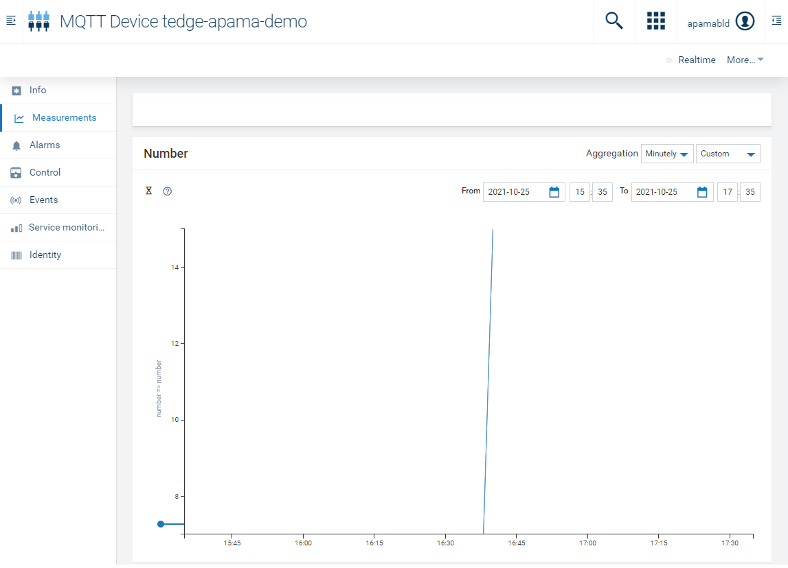

# Prerequisites

- A Raspberry Pi (minimum version 3) running Raspberry Pi OS 32bit. 
- thin-edge.io installed to the Raspberry Pi, which can be done by following the instructions [here](https://github.com/thin-edge/thin-edge.io/blob/main/docs/src/howto-guides/002_installation.md).
- _Recommended:_ thin-edge configured with connection to Cumulocity or Azure using the instructions
[here](https://github.com/thin-edge/thin-edge.io/blob/main/docs/src/howto-guides/004_connect.md).

## Optional

These are not essential to be able to run the examples provided. If you want to
modify or extend the examples or implement a real solution with Apama and
thin-edge we recommend you follow the guidance on creating, configuring and
deploying a project contained within this document.

- A full installation of [Apama Community Edition](https://apamacommunity.com/downloads/)
including Software AG Designer on a laptop or PC.
- Docker and the apama-builder and apama-correlator images. See the links below
for more details.
	- https://tech.forums.softwareag.com/t/apama-builder-for-docker/237796
	- https://hub.docker.com/_/softwareag-apama-builder
	- https://hub.docker.com/_/apama-correlator

# Setup and Configuration
## Installing Apama Community Core to the Raspberry Pi
Download the Apama Community Core zip for Arm to the Raspberry Pi. The latest version is available from the [Apama Community Edition Downloads page](https://www.apamacommunity.com/downloads/).

Untar the archive to /opt/softwareag:

```
mkdir /opt/softwareag
tar -xzf apama_core_<version>_armv7_linux.tar.gz --directory /opt/softwareag
```

## Installing the Apama Server Script
Clone the Thin-edge examples github repository to the home directory of the Raspberry Pi:

```
cd ~
git clone https://github.com/thin-edge/thin-edge.io_examples.git
```

Copy the Apama server script to `/etc/init.d`, make it executable then run the
install command:

```
sudo cp thin-edge.io_examples/StreamingAnalytics/src/service/apama /etc/init.d
sudo chmod +x /etc/init.d/apama
sudo service apama install
```

This service will start a correlator with the project located in
`/etc/tedge/apama/project`. If no project exists in that location, the script
exits without starting the correlator.

To set up the service to run on startup, run the command:
```
sudo /sbin/update-rc.d apama defaults 80
```

# Quick Start
For demonstration purposes a simple project has been provided with this repository which listens 
for events on the 'demo/number' MQTT topic, increments the number by 1, and sends it back to the 
`tedge/measurements` topic.

Copy the project located in the `StreamingAnalytics/src` directory of this repository to the 
`/etc/tedge/apama/project` directory on the Raspberry Pi:

```
sudo cp -r thin-edge.io_examples/StreamingAnalytics/src/quickstart/ /etc/tedge/apama
```
Now skip to the [launching instructions](#launching-a-project) to launch the project.

# Creating a Software AG Designer Project
## Creating a New Project
- Open Software AG Designer on the laptop or PC and select a workspace (the default location is fine).
- Start a new project by choosing __File → New → Apama Project__.
- Give your project a name then click 'Next'.
- Add the MQTT connectivity plug-in from 'Connectivity bundles' and JSON support from 'Standard 
bundles' to the project then click the  finish button.

## Configuring MQTT Support
Open the MQTT.properties file.  This contains the configurations relating to the MQTT broker. 
Thin-edge uses Mosquitto as the MQTT broker which will be running on the same host as the Apama 
project.  The thin-edge Mosquitto broker is configured to not require SSL/TLS or password 
authentication for internal traffic. 

>In the Project Explorer tab, configuration files for MQTT can be found under __config → 
connectivity → MQTT__. 

The MQTT_brokerURL should be set as below:
```
MQTT_brokerURL=localhost
```
A full example of MQTT.properties can be found [here](src/quickstart/project/config/connectivity/MQTT/MQTT.properties).

>Unless manually configured otherwise, the thin-edge MQTT broker will operate on the default 
port 1883.

Open the MQTT.yaml file.  This contains configuration relating to the chain which maps the MQTT 
messages to EPL events.

MQTT messages need to be mapped to EPL events in order to be able to use them within Apama.  The 
easiest way to do this for this purpose is using the 
[Classifier codec](https://www.apamacommunity.com/documents/10.11.0.1/apama_10.11.0.1_webhelp/apama-webhelp/#page/apama-webhelp%2Fco-ConApaAppToExtCom_classifier_codec.html%23wwconnect_header) 
which will inspect incoming events on the transport and classify them, usually to an EPL event 
type, based upon their payload and metadata.  

An example MQTT.yaml file which contains the mapping for a single event with a single member can 
be found [here](src/quickstart/project/config/connectivity/MQTT/MQTT.yaml), more examples can be 
found within the other Streaming Analytics sample projects in this repository.

## Writing Apama Projects

The quickstart example (see [Quick Start](#quick-start)) and the samples in this directory show 
some examples of EPL for some basic use cases.  The full EPL reference can be found 
[here](https://www.apamacommunity.com/documents/10.11.0.1/apama_10.11.0.1_webhelp/ApamaDoc/index.html).


## Deploying a Project
To deploy a project, use the `engine_deploy` utility provided with apama.  Navigate to the 
workspace directory in a command prompt/terminal and run the following command in an `apama_env` 
prompt (see ['Setting up the environment using the apama command prompt'](https://www.apamacommunity.com/documents/10.11.0.1/apama_10.11.0.1_webhelp/apama-webhelp/#page/apama-webhelp%2Fco-DepAndManApaApp_setting_up_the_environment_using_the_apama_command_prompt.html)):
```
engine_deploy --outputDeployDir project <project-src-dir>
```
Take the 'project' directory output by `engine_deploy` and copy it to the `/etc/tedge/apama` 
directory on the Raspberry Pi.

# Launching a Project
To launch the project, use the command below to start the service.  The restart function first 
checks to see if the project is already running and attempts to perform a graceful shutdown of 
the correlator if it is.  It then starts a new correlator with the project located in 
`/etc/tedge/apama/project`.

```
sudo service apama restart
```

>If you update or replace the project in `/etc/tedge/apama/project`, you will need to restart 
the service again to load the new configuration.

# Testing a Project
To publish messages to MQTT, thin-edge has a [built in command](https://github.com/thin-edge/thin-edge.io/blob/main/docs/src/howto-guides/005_pub_sub.md).  You can publish/subscribe to any 
MQTT topic using this command not just thin-edge specific ones.  The messages should be valid 
[thin-edge JSON](https://github.com/thin-edge/thin-edge.io/blob/main/docs/src/architecture/thin-edge-json.md) format.

To test the quick-start example, first open a terminal to subscribe to the `tedge/measurements` 
topic:

``` 
tedge mqtt sub tedge/measurements
```
In a separate terminal send some messages formatted like below:
```
tedge mqtt pub 'demo/number' '{ "number": 3 }'
```

The output numbers in the `tedge/measurements` topic should be the original test values 
incremented by 1.

If you followed the recommended prerequisite of connecting thin-edge to a cloud provider such as 
Cumulocity or Azure, any (valid tedge JSON) messages published to `tedge/measurements` will now also be appearing 
in the device measurement interface.


